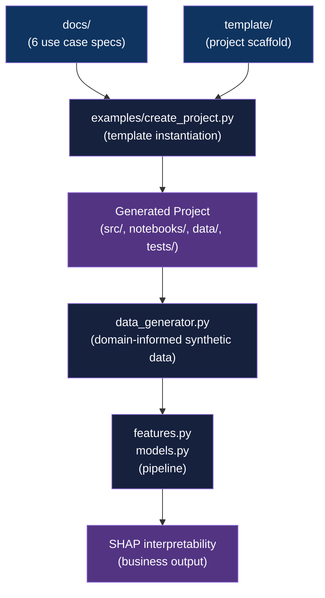

<div align="center">

# Telecom ML Framework

[](https://www.python.org/downloads/)
[](LICENSE)

**Spec-first ML project templates and domain-informed data generators for 6 telecom use cases**

[Getting Started](#getting-started) | [Usage](#usage) | [Architecture](#architecture)

</div>

---

## Table of Contents

- [The Problem](#the-problem)
- [Features](#features)
- [Tech Stack](#tech-stack)
- [Architecture](#architecture)
- [Getting Started](#getting-started)
  - [Prerequisites](#prerequisites)
  - [Installation](#installation)
- [Usage](#usage)
- [How It Works](#how-it-works)
- [Architectural Decisions](#architectural-decisions)
- [Project Structure](#project-structure)
- [Related Projects](#related-projects)
- [License](#license)
- [Author](#author)

## The Problem

### Telecom ML Projects Lack a Shared Starting Point

Starting a telecom ML project from scratch means repeatedly solving the same problems: how to frame a business problem as an ML task, which features to engineer without leaking future data, how to generate realistic synthetic data when production data is proprietary, and what evaluation metrics a network ops stakeholder actually cares about.

### The Solution

This framework provides 6 fully-specified use cases covering the most common telecom AI/ML problem types (classification, regression, anomaly detection, forecasting, root cause analysis, reinforcement learning), each paired with a domain-informed data generator and a standardised project template that scaffolds the full pipeline from data to SHAP interpretability.

## Features

- **6 use case specifications** - complete problem framing, forbidden features (temporal leakage prevention), model architecture recommendations, and SHAP interpretability requirements for each
- **Domain-informed data generators** - hand-crafted synthetic data embedding real telecom physics: SINR calculations, Shannon capacity bounds, QoE MOS scores, congestion patterns, diurnal traffic cycles
- **Project template** - `template/` directory with `src/`, `notebooks/`, `data/`, and `tests/` layouts; copy or generate via script
- **Automated project creation** - `examples/create_project.py` scaffolds a named project from the template, renames the Python package, and substitutes placeholders in one command
- **Unified technical standards** - SHAP-compatible dependency pinning (`numpy<2.0`, `xgboost<2.0`, `numba>=0.59.0`), Seaborn plotting conventions, Ruff linting, uv-managed environments across all generated projects

## Tech Stack

| Component | Technology |
|-----------|------------|
| Language | Python 3.11+ |
| Package manager | uv |
| ML algorithms | XGBoost, LightGBM, CatBoost, Prophet, ARIMA, LSTM, Isolation Forest, Q-Learning |
| Interpretability | SHAP |
| Linting | Ruff |
| Build backend | Hatchling |

## Architecture



## Getting Started

### Prerequisites

- Python 3.11+
- uv package manager ([install](https://github.com/astral-sh/uv))

```bash
curl -LsSf https://astral.sh/uv/install.sh | sh
```

### Installation

1. Clone the repository:
   ```bash
   git clone https://github.com/adityonugrohoid/telecom-ml-framework.git
   cd telecom-ml-framework
   ```

2. No runtime dependencies are needed for the framework itself. Dependencies for generated projects are managed via `template/pyproject.toml` and installed inside each project with `uv sync`.

## Usage

### Option 1: Automated (recommended)

```bash
python examples/create_project.py \
  --name churn-prediction \
  --use-case UC1 \
  --output ../my-projects/

cd ../my-projects/churn-prediction
uv sync
uv run python -m churn_prediction.data_generator
uv run jupyter lab notebooks/
```

### Option 2: Manual template copy

```bash
cp -r template/ ../my-churn-prediction
cd ../my-churn-prediction

# Rename src/__project_name__/ to your package name
mv src/__project_name__ src/churn_prediction

# Update pyproject.toml with your project name
uv sync
uv run python -m churn_prediction.data_generator
```

Available use cases (`--use-case` values):

| Code | Use Case | ML Type |
|------|----------|---------|
| UC1 | Churn Prediction | Binary Classification (XGBoost, LightGBM) |
| UC2 | Root Cause Analysis | Ranking / Causal Inference (Gradient Boosting, GNN) |
| UC3 | Anomaly Detection | Unsupervised (Isolation Forest, LSTM Autoencoder) |
| UC4 | QoE Prediction | Regression (LightGBM, CatBoost) |
| UC5 | Capacity Forecasting | Time-Series (Prophet, ARIMA, LSTM) |
| UC6 | Network Optimization | Reinforcement Learning (Q-Learning, Genetic Algorithms) |

See [`docs/USE_CASES.md`](docs/USE_CASES.md) for selection guidance and [`docs/GETTING_STARTED.md`](docs/GETTING_STARTED.md) for a full walkthrough.

## How It Works

### 1. Use Case Specification

Each use case in `docs/` defines: the business problem, ML task type, input features, explicitly forbidden features (to prevent temporal leakage), label definition, model architecture, evaluation metrics, notebook structure, and SHAP output requirements. These specs drive both the data generator and the model implementation.

### 2. Domain-Informed Data Generation

Each generated project's `data_generator.py` is pre-configured for its use case. The generators embed telecom physics directly:

- UC1 (Churn): QoE degradation trajectories over 30/60/90-day windows with controlled class imbalance
- UC3 (Anomaly): Multivariate KPI time-series with realistic diurnal cycles; anomalies introduced as SINR drops or throughput collapses
- UC5 (Capacity): Traffic load series with weekend effects, growth trends, and confidence-interval annotations
- UC6 (Optimization): State-action-reward environment modelling parameter changes and their delayed KPI effects

### 3. Template Instantiation

`examples/create_project.py` copies `template/`, renames `src/__project_name__/` to the user's package name, and substitutes placeholders in `pyproject.toml`, `README.md`, `QUICKSTART.md`, and all Python source files in one pass.

## Architectural Decisions

### 1. Spec-first, no implementation

**Decision:** This repo ships specifications and templates only, not trained models or a pip-installable library.

**Reasoning:** Production telecom data is proprietary. Starting with a clear ML problem specification and a realistic (but hand-crafted) synthetic dataset is more honest and more reproducible than training on an off-the-shelf public dataset that does not reflect real network behaviour. Each implementation lives in its own standalone repo.

### 2. uv over pip/conda

**Decision:** All template projects use uv for dependency management.

**Reasoning:** uv resolves and installs in seconds vs minutes, produces deterministic lockfiles, and avoids the environment pollution common with conda. SHAP's compatibility constraints (`numpy<2.0`, `xgboost<2.0`) make deterministic pinning essential.

### 3. SHAP compatibility pinning

**Decision:** `template/pyproject.toml` pins `numpy<2.0`, `xgboost<2.0`, and `numba>=0.59.0` as hard constraints.

**Reasoning:** SHAP 0.44-0.45 breaks silently with numpy 2.x, producing NaN explanations. The pinning is explicit in the template so every generated project inherits it without debugging this the first time.

### 4. Hand-crafted data generators over generic tools

**Decision:** Each use case ships its own `data_generator.py` rather than using Faker or SDV.

**Reasoning:** Generic synthetic data tools do not know that LTE SINR follows a specific distribution, that QoE MOS is bounded by application type, or that capacity load has diurnal periodicity. The hand-crafted generators embed these constraints so that derived features and model outputs are physically plausible, demonstrating domain expertise in the process.

## Project Structure

```
telecom-ml-framework/
|-- docs/
|   |-- USE_CASES.md              # Comparison and selection guide for all 6 use cases
|   |-- GETTING_STARTED.md        # Step-by-step first project walkthrough
|   |-- PORTFOLIO_OVERVIEW.md     # Portfolio context
|   |-- 01-CHURN-PREDICTION.md    # Use case specification
|   |-- 02-ROOT-CAUSE-ANALYSIS.md
|   |-- 03-ANOMALY-DETECTION.md
|   |-- 04-QOE-PREDICTION.md
|   |-- 05-CAPACITY-FORECASTING.md
|   `-- 06-NETWORK-OPTIMIZATION.md
|
|-- template/                     # Copy this to start a new project
|   |-- src/__project_name__/     #   Python package (renamed by create_project.py)
|   |-- notebooks/                #   Jupyter notebook layout
|   |-- data/                     #   raw/ and processed/ directories
|   |-- tests/                    #   Data quality test stubs
|   `-- pyproject.toml            #   Dependencies with SHAP compatibility constraints
|
|-- examples/
|   `-- create_project.py         # Automated project scaffolding script
|
`-- pyproject.toml                # Framework package metadata (no runtime deps)
```

## Related Projects

| Project | Description |
|---------|-------------|
| [telecom-ml-portfolio](https://github.com/adityonugrohoid/telecom-ml-portfolio) | Index of all implemented portfolio projects built from this framework |
| [telecom-churn-prediction](https://github.com/adityonugrohoid/telecom-churn-prediction) | UC1 implementation: binary classification on customer QoE degradation patterns |
| [telecom-root-cause-analysis](https://github.com/adityonugrohoid/telecom-root-cause-analysis) | UC2 implementation: alarm-sequence ranking with causal graph output |
| [telecom-anomaly-detection](https://github.com/adityonugrohoid/telecom-anomaly-detection) | UC3 implementation: unsupervised cell tower KPI monitoring |
| [telecom-qoe-prediction](https://github.com/adityonugrohoid/telecom-qoe-prediction) | UC4 implementation: MOS score regression from session-level network KPIs |
| [telecom-capacity-forecasting](https://github.com/adityonugrohoid/telecom-capacity-forecasting) | UC5 implementation: traffic load forecasting with seasonal decomposition |
| [telecom-network-optimization](https://github.com/adityonugrohoid/telecom-network-optimization) | UC6 implementation: RL-based parameter tuning for KPI improvement |

## License

This project is licensed under the [MIT License](LICENSE).

## Author

**Adityo Nugroho** ([@adityonugrohoid](https://github.com/adityonugrohoid))
